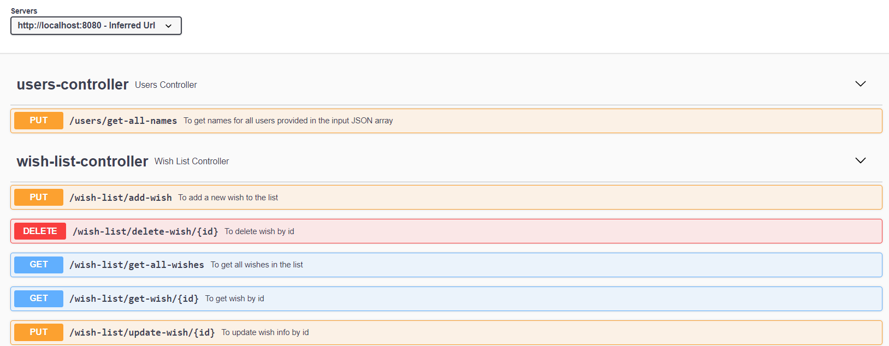

# 🥰 🥰 🥰 Wish list 🥰 🥰 🥰

## Goal

Izveidot REST API (varat izmantot pēc izvēles: JAVA,  Node.js vai C#) ar datubāzes izmantošanu (pēc izvēles : MS SQL, Postgre vai MongoDB), kur realizēt loģikas implementēšanu priekš “Vēlmju saraksts” pārklāt to ar unit testiem. Izveidot arī projekta struktūru ar visiem nepieciešamiem slāņiem, sekojot labām praksēm.

Nepieciešams realizēt:

### 1. Pievienot vēlmi 

### 2. Atjaunot vēlmi

### 3. Dzēst vēlmi

### 4. Saņemt vēlmi 

### 5. Saņemt sarakstu ar vēlmēm

### 6. Papildu uzdevums: 

Izveidot atsevišķu ceļu, kurā pieņemt JSON request:

{
                "users": [{
                                                "type": "user",
                                                "id": 150709,
                                                "name": "johnsmith",
                                                "email": "jsmith@example.com"
                                }, {
                                                "type": "user",
                                                "id": 150710,
                                                "name": "angelinasmith",
                                                "email": "asmith@example.com"
                                },
                                // <…>
                                {
                                                "type": "user",
                                                "id": 150910,
                                                "name": "adamivanov",
                                                "email": "aivanov@another.org"
                                }
                ]
}

Mērķis ir apkopot visus “name” laukus un savienot tos ar komatu kā atdalītāju. API response jābūt: johnsmith, angelinasmith,….

## Description

REST API using JAVA + PostgreSQL database

## Setup

Just clone this repository

## Usage

The program can be run via   `./gradlew bootRun`

After running endpoint description is available in [Swagger](http://localhost:8080/swagger-ui/index.html)

## Tests

The tests can be run via  `./gradlew clean test`